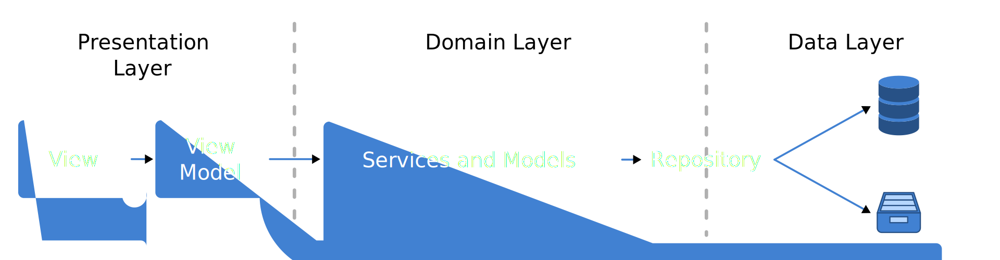

# App architecture

The following architecture is based on the MVVM ([Model View ViewModel](https://de.wikipedia.org/wiki/Model_View_ViewModel)) design pattern.


## Architecture Principle

An app should be built in layers, with each layer sitting on top of another. A class in one layer should only depend on classes in the layer below it. If multiple classes in the same layer need to know the same information, that information should likely be in the layer below those classes.




### Fundamental building blocks:
- [Views](doc/VIEWS.md)
- [View Models](doc/VIEW_MODELS.md)
- [Models](doc/MODELS.md)
- [Repositories and Services](doc/REPOSITORIES_AND_SERVICES.md)

## File structure

This uses the so called feature-first folder structure, with the exception of having a "shared" directory. A feature is not necessarily a screen. It rather resembles a functionality like "authenticate", "leave_review" o "measure_floorplan".

```
├── shared
│   ├── models
│   ├── utils
│   ├── widgets
│   ├── services
|   ├── repositories
│   └── ...
└── features
    ├── feature_01
    │   ├── view_models
    │   ├── models
    │   ├── utils
    │   └── widgets
    ├── feature_02
    │   ├── view_models
    │   ├── utils
    │   ├── widgets
    │   │   └── widget_group
    │   └── ...
    └── ...
```

## Naming conventions and code style

This project follows the effective dart style naming conventions which can be found [here](https://dart.dev/guides/language/effective-dart/style).

Any function call or class instantiation that exceeds the suggested line length should be wrapped. **Note the trailing comma** for the last parameter. This ensures that the dart formatter will format this function accordingly.

```dart
myFunction(
  val1,
  namedPara1: val2,
  namedPara2: val3,
);
```


## The Contract:

1. **Widgets never get models as parameters.**
This ensures their independency from the underlying model data structure. Instead every required model data is passed as a single property to the widget. Immutable objects like `Offset`, `Rect`, `Duration`, `DateTime` etc. do **not** count as models and can be passed to a widget.

1. **ViewModels should avoid exposing models directly.**
Instead expose primitive data types or immutable classes. In cases where a list of models is required, exposing the models is inevitable. In such cases expose them as an `Iterable`, `UnmodifiableListView` or `UnmodifiableMapView`.

1. **Data shared between View Models must be stored in a Shared-Repository or -Service.**
The class interface should be generic enough so every dependent View Model can operate on it

1. **Never write any logic in the View.**
Exceptions are cosmetic logic like showing or hiding a widget, animations etc.

1. **Views must not contain any app state.**
Exception: ephemeral state for base components/reusable widgets (for example AnimatedWidgets). Ephemeral state like the selected entry of a list should be stored inside the **View Model**.

1. **ViewModels should not contain business logic.**
    Dos:
    - [x] Formatting to a String
    - [x] Minor validation
    - [x] If property X is set then Y should be viewed.

    Don'ts:
    - [ ] Does a Building with the name already exist?
    - [ ] Computations

## Dependencies

- [mobx](https://pub.dev/packages/mobx) - State-Management Library
- [flutter_mobx](https://pub.dev/packages/flutter_mobx) - Flutter integration for MobX
- [get_it](https://pub.dev/packages/get_it) - Service Locator


## FAQ

#### How can I trigger dialogs/snack bars from the View Model?

For user prompts use the `PromptMediator` and `PromptHandler` mixins from the utils directory.

For snack bars use the `NotificationMediator` and `NotificationHandler` mixins from the utils directory..


#### How to use *MobX* for adding and removing items in animated list widget?

https://dexterx.dev/combining-flutters-animatedlist-with-mobx/


------------------------------------------------------

TODOS:

Exceptions are best defined at the bottom of the class files that throw them.

Throw custom exceptions in underlying models and services (*if necessary*) and handle them in the view model.
Avoid *writing* (not using) business logic, low level API calls or algorithmic code in the view model.

## Repository/Service/Model

```dart
class ExampleModel {
  final Object? obj;

  void customUpdateFunction() {
    if (obj == null) {
      throw CustomException("The message that describes the reason and failure");
    }
    else {
      try {
        obj.elements.first.doSomething();
      }
      on StateError {
        throw CustomException2("The message that describes the reason and failure");
      }
    }
  }

}
```

## ViewModel
```dart
class ExampleViewModel {
  final model = ExampleModel();

  void customUpdateFunction() {
    try {
      model.customUpdateFunction();
    }
    on CustomException {
      // do nothing
    }
    on CustomException2 {
      notifications.add("For the reason X this did not work");
    }
    catch (e) {
      notification.add("An unknown error occured, please try again later");
    }
  }
}
```
